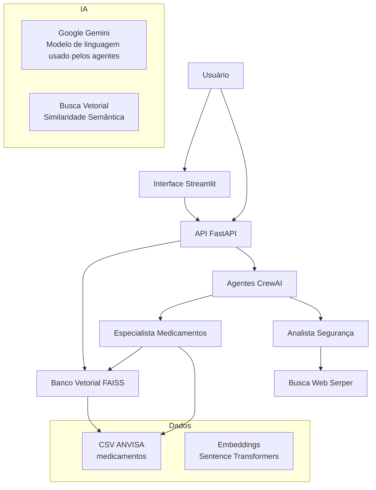

# Sistema MedAI

Sistema inteligente de recomendação de medicamentos baseado em dados oficiais da ANVISA com análise por IA.

## Sobre o Projeto

O **Sistema MedAI** : surge no contexto de atender uma demanda latente da sociedade brasileira **o problema de automedicação praticado por muitas pessoas sem ao menos uma pesquisa prévia sobre o assunto**. Nesse contexto o objetivo do presente sistema é garantir um acesso direto a informações sobre os medicamentos adequados para o indivíduo com base em um diagnóstico a partir dos sintomas relatados, como também disponibilizar para o individuo uma série de medicamentos que pode usar para lidar com o seu problema, como também encaminhar para ele os devidos links para o atendimento com profissionais da saúde adequados com base em seu problema, pois sabendo que o usuário ao ler sobre os medicamentos e o devido grau de risco de cada um, podemos induzir ele a entrar em contato com o médico, pois o link de contato já vai estar logo abaixo dos medicamentos no output do sistema. Assim conseguindo de maneira indireta levar algumas das pessoas que iriam se automedicar com o sistema a ir atrás de um especialista para lidar com o problema que a pessoa está tendo.

O **Sistema MedAI** é capaz realizar uma busca vetorial busca através de similaridade semântica para encontrar medicamentos por descrição de sintomas, realizar a análise automática de segurança e recomendações personalizadas com base em registros oficiais da ANVISA para fornecer os medicamentos, links de especialistas para o usuário poder posteriormente consultar relacionados com os problemas detectados pela descrição dos sintomas como também toda uma análise envolvendo o grau de risco, seo o medicamento precisa de receita ou não e se há urgência de encontrar um especialista devido ao sintomas, tudo isso sendo feito por agentes. Além disso o MedAi possui uma dashboard intuitiva com visualizações interativas, onde há botões para fornecer uma avaliação automática de segurança e necessidade de receita médica e outras duas ambas onde você pode pesquisar por informações de um medicamento específico que conhece ou saber um pouco sobre as informações dos top 10 medicamentos da base.

## Tecnologias Utilizadas

### Backend & IA
| Tecnologia | Versão | Função |
|------------|--------|---------|
| **Python** | 3.12 | Linguagem principal |
| **FastAPI** | 0.100+ | API REST moderna e rápida |
| **FAISS** | 1.11+ | Banco vetorial para busca semântica |
| **Sentence Transformers** | 4.1+ | Geração de embeddings de texto |
| **CrewAI** | 0.95+ | Orquestração de agentes IA |
| **Google Gemini** | 2.0-flash | Modelo de linguagem |
| **Pandas** | 2.0+ | Processamento de dados |

### Frontend & Interface
| Tecnologia | Versão | Função |
|------------|--------|---------|
| **Streamlit** | 1.30+ | Interface web interativa |
| **Plotly** | 5.15+ | Visualizações de dados |

### Infraestrutura
| Tecnologia | Versão | Função |
|------------|--------|---------|
| **Docker** | - | Containerização |
| **Docker Compose** | - | Orquestração de containers |
| **Uvicorn** | 0.18+ | Servidor ASGI |

### APIs Externas
| Serviço | Função |
|---------|---------|
| **Google Gemini API** | LLM dos agentes |
| **Serper API** | Busca web para orientações médicas |


## Instalação e Configuração

### Pré-requisitos

- **Docker** e **Docker Compose** (Recomendado)
- **Python 3.12+** (Para execução local)
- **Git** para clonar o repositório

### Instalação com Docker (Recomendada)

#### 1. Clone o repositório
```bash
git clone https://github.com/lucascristianoo/MedAI.git
cd sistema-medai
```

#### 2. Configure as variáveis de ambiente
```bash
# Copie o arquivo de exemplo
cp .env.exemplo .env

# Edite com suas chaves de API
nano .env
```

**Configuração do .env:**
```env
# Obrigatório - Chave do Google Gemini (GRATUITA)
GEMINI_API_KEY=sua_chave_gemini_aqui

# Obrigatório - Chave do Serper para busca web (GRATUITA até 2500 consultas)
SERPER_API_KEY=sua_chave_serper_aqui

# Opcional - Modelo de IA (padrão já otimizado)
MODEL_NAME=gemini/gemini-2.0-flash
```

#### 3. Baixe os dados da ANVISA
```bash
# Criar diretório de dados
mkdir -p data

# Baixar dados oficiais da ANVISA (último update)
wget -O data/DADOS_ABERTOS_MEDICAMENTOS.csv \
  "https://dados.anvisa.gov.br/dados/DADOS_ABERTOS_MEDICAMENTOS.csv"
```

#### 4. Execute o sistema
```bash
# Subir todos os serviços
docker-compose up --build -d

# Verificar se subiu corretamente
docker-compose ps
```

#### 5. Acesse as aplicações
- **Interface Web**: http://localhost:8501
- **API REST**: http://localhost:8000
- **Documentação API**: http://localhost:8000/docs

### Instalação Local (Alternativa)

#### 1. Clone e configure
```bash
git clone https://github.com/lucascristianoo/sistema-medai.git
cd sistema-medai
cp .env.exemplo .env
# Configure o .env conforme acima
```

#### 2. Instale dependências
```bash
# Usando UV (mais rápido)
pip install uv
uv pip install -r requirements.txt

# OU usando pip tradicional
pip install -r requirements.txt
```

#### 3. Processe os dados
```bash
# Baixar dados da ANVISA
mkdir -p data
wget -O data/DADOS_ABERTOS_MEDICAMENTOS.csv \
  "https://dados.anvisa.gov.br/dados/DADOS_ABERTOS_MEDICAMENTOS.csv"

# Processar dados para banco vetorial
python limpeza.py
```

#### 4. Execute os serviços
```bash
# Terminal 1 - API
python api.py

# Terminal 2 - Interface (novo terminal)
streamlit run interface.py
```

## Como Executar e Usar

### Comandos Docker

```bash
# Iniciar sistema
docker-compose up -d

# Ver logs em tempo real
docker-compose logs -f

# Parar sistema
docker-compose down

# Rebuild completo (após mudanças)
docker-compose down
docker-compose up --build -d

# Limpar cache Docker
docker system prune -f
```

### Testando a API

```bash
# Verificar status
curl http://localhost:8000/status

# Busca simples de medicamentos
curl -X POST http://localhost:8000/busca_simples \
  -H "Content-Type: application/json" \
  -d '{"sintomas": "dor de cabeça forte", "top_k": 3}'

# Análise completa com IA
curl -X POST http://localhost:8000/analisar_sintomas \
  -H "Content-Type: application/json" \
  -d '{"descricao": "dor de cabeça intensa com náuseas"}'

# Detalhes de medicamento específico
curl -X POST http://localhost:8000/detalhes_medicamento \
  -H "Content-Type: application/json" \
  -d '{"nome_medicamento": "paracetamol"}'
```

###  Usando a Interface Web

#### 1. Acesse http://localhost:8501

#### 2. **Busca por Sintomas**
- Digite sintomas detalhados: "dor de cabeça intensa com náuseas"
- Escolha entre:
  - **Buscar**: Busca rápida por similaridade
  - **Análise com IA**: Análise completa com agentes especializados

#### 3. **Busca por Medicamento**
- Digite nome do medicamento: "paracetamol"
- Veja informações detalhadas do registro na ANVISA

#### 4. **Estatísticas**
- Visualize dados do sistema
- Gráficos de categorias terapêuticas
- Métricas de popularidade

##  Capturas de Tela

###  Tela Principal

*Interface principal com busca por sintomas e status do sistema*

###  Busca por Sintomas

*Resultado da busca mostrando medicamentos similares aos sintomas*

### Análise com IA

*Análise completa dos agentes especializados com recomendações*

### Detalhes do Medicamento

*Informações detalhadas de medicamento específico*

### Estatísticas da base

*Top 10 medicamentos segundo a base*

##  Configuração de APIs

###  Google Gemini API (Obrigatória)
1. Acesse: [Google AI Studio](https://makersuite.google.com/app/apikey)
2. Faça login com conta Google
3. Clique "Create API Key"
4. Copie a chave e cole no `.env`

### Serper API (Obrigatória)
1. Acesse: [Serper.dev](https://serper.dev/)
2. Registre-se gratuitamente
3. Pegue sua API key no dashboard
4. Copie e cole no `.env`
## Arquitetura do Sistema



## Estrutura do Projeto

```
sistema-medai/
├──  data/                              # Dados da ANVISA
│   └── DADOS_ABERTOS_MEDICAMENTOS.csv  # CSV original (50k+ registros)
├──  anvisa_medicamentos.csv            # Dados processados (2.5k medicamentos)
├──  api.py                             # API FastAPI principal
├──  interface.py                       # Interface Streamlit
├──  agentes.py                         # Agentes CrewAI especializados
├──  vector_database.py                 # Banco vetorial FAISS
├──  limpeza.py                         # Processamento de dados
├──  Dockerfile                         # Container Docker
├──  docker-compose.yml                 # Orquestração containers
├──  requirements.txt                   # Dependências Python
├──  .env.exemplo                       # Exemplo de configuração
├──  MedAI_Basico.json                  # Fluxo no Langflow que é uma versão bem mais simples do projeto final
├──  README.md                          # Documentação (este arquivo)
└──  imagens                            # Capturas de tela
```

## Avisos Importantes

- **Sistema apenas informativo** - não substitui consulta médica
- **Não pratique automedicação** - sempre consulte profissional
- **Configure chaves de API adequadamente** - necessário para IA funcionar
- **Dados da ANVISA podem não contemplar o medicamento procurado** - No momento não são atualizados periodicamente

> *Sistema desenvolvido como projeto final Fastcamp de Agentes Inteligentes, oferecido pelo Ceia em parceira com o LAMIA.*
